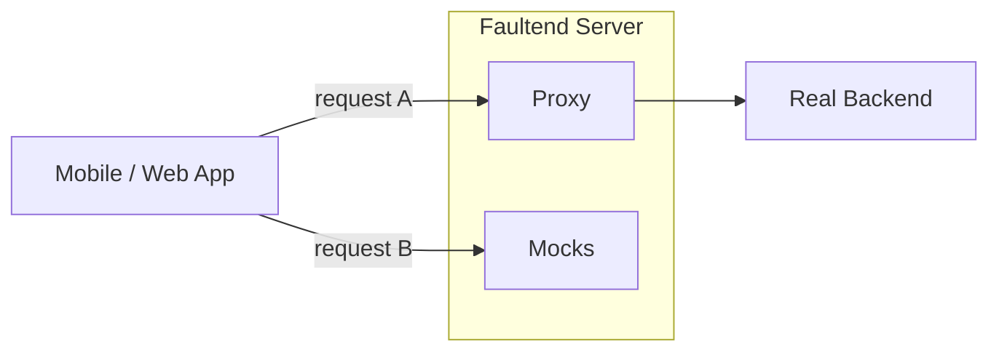

#  Faultend

A lightweight proxy for testing application resilience against unreliable backends.

Route REST + JSON traffic through Faultend to inspect requests/responses in real-time and simulate failures with one click.

## How It Works

1. **Launch** Faultend and configure your app to use it as your backend
2. **Create rules** to route traffic to your real backends (e.g., `api.myapp.com`, `auth.myapp.com`)
3. **Interact** with your app normally - see all traffic live in the Faultend UI
4. **Click** any request to convert it into a mock or proxy rule
5. **Simulate** failures by editing status codes, bodies, or adding latency
6. **Learn** how your App behaves

## Features

- **Multi-Backend Routing**: Route different endpoints to different services
- **One-Click Mocking**: Convert logged requests into mocks instantly
- **Priority-Based Rules**: Control evaluation order for precise handling
- **Failure Injection**: Simulate latency, errors, and edge cases
- **Export/Import**: Share configurations as JSON files
- **Real-Time Inspection**: See all traffic with full request/response bodies

**Rules-based routing**: Each rule either:
- **Mocks** a response (custom status, body, latency)
- **Proxies** to a specified backend URL

**Hosts by scope**:
- `domain` - Landing page
- `app.domain/api` - Headless app - manage fault servers through API
- `app.domain` - Admin UI - Configure rules and view traffic
- `[server-id].domain` - Isolated proxy instances

## Tech Stack

- **Backend**: Node.js, Express, http-proxy-middleware
- **Frontend**: Vanilla HTML/CSS/JavaScript
- **Storage**: PostgreSQL with connect-pg-simple sessions

---

Built to make app's resilience testing accessible, fast, and practical.
