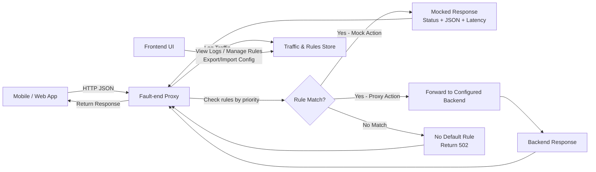

# Fault-end

**Fault-end** is a lightweight proxy tool designed to help developers and testers validate the resilience of mobile and web applications against unreliable backend behavior.  
By routing REST + JSON traffic through Fault-end, you can inspect real requests and responses in real time and, with a single click, transform them into mocked or modified responses.

## 🚀 Motivation

Applications rarely run under perfect network and backend conditions. Timeouts, inconsistent payloads, slow endpoints, and error spikes all happen in production, yet they are difficult to reproduce reliably during development.

Fault-end focuses on making this type of testing effortless.  
Instead of scripting mocks, modifying environments, or spinning up complex stacks, you simply point your application to Fault-end and start interacting with your UI. Fault-end forwards traffic to the real backend, logs everything, and lets you override any request instantly.

The goal is to make **resilience testing accessible, fast, and practical**.

## 🎯 Use Case Scenario

A typical workflow with Fault-end looks like this:

1. Launch Fault-end and open the UI.
2. Configure your mobile/web app to use Fault-end's base URL (e.g., `faultend.myapp.com`).
3. Set up proxy rules to define which backends to forward traffic to (e.g., `api.myapp.com`, `auth.myapp.com`).
4. Interact with your app normally. Fault-end routes requests based on your rules.
5. Each request/response appears live in the UI.
6. Click a logged request to **convert it into a mock or proxy rule**.
7. Edit the auto-filled form:
   - Method and path regex pattern
   - Action: Mock (custom response) OR Proxy (forward to backend)
   - For mocks: status code, JSON body, optional latency
   - For proxies: target backend URL
   - Rule priority (higher priority rules evaluated first)
8. Save the rule. Future matching requests follow your rule.
9. Observe how your app behaves under controlled failure scenarios.
10. Export your complete rule configuration as JSON for easy replication across environments.

No scripts. No DSLs. No environment gymnastics.

## ✨ Key Features

- **Flexible Routing**: Define rules to mock responses OR proxy to multiple backend services
- **Multi-Backend Support**: Route different endpoints to different backends (microservices-friendly)
- **Priority-Based Rules**: Control rule evaluation order for precise request handling
- **One-Click Mock Creation**: Convert any logged request into a mock with auto-filled data
- **Export/Import Configuration**: Save and share your entire rule setup as JSON
- **Real-time Traffic Inspection**: See all requests and responses with full body capture
- **Artificial Failure Injection**: Simulate slow responses, errors, and edge cases
- **Zero Configuration Proxy**: Start with a simple catch-all proxy rule, add mocks as needed

## 🛠 Technical Overview

Fault-end is composed of two main parts:

### Backend  
A small reverse proxy optimized strictly for REST + JSON:
- Routes requests based on configurable rules (priority-ordered)
- Rules can mock responses OR proxy to specified backends
- Supports multiple backend targets for microservice architectures
- Applies mock rules on the fly (status, body, latency)
- Stores traffic logs and rule definitions
- Export/import rule configurations as JSON
- Exposes a simple API for the frontend  

The backend is intentionally minimal and focused to support a clean UX.

### Frontend  
A UI built for clarity and speed:
- Real-time traffic viewer with filtering
- One-click creation of mock OR proxy rules from logged requests
- Rule editor with action selection (mock vs proxy)
- Rule list with priority management and enable/disable controls
- Export/import functionality for rule configurations

The user experience is the priority, keeping the workflow intuitive and frictionless.

## 📐 High-Level Architecture

### Deployment Model

- **One Fault-end instance = One app/tester**
- Deploy at a custom domain (e.g., `faultend.myapp.com`)
- Configure rules for your specific testing needs
- Data and rules are isolated per instance
- Export configurations to replicate setups across environments
